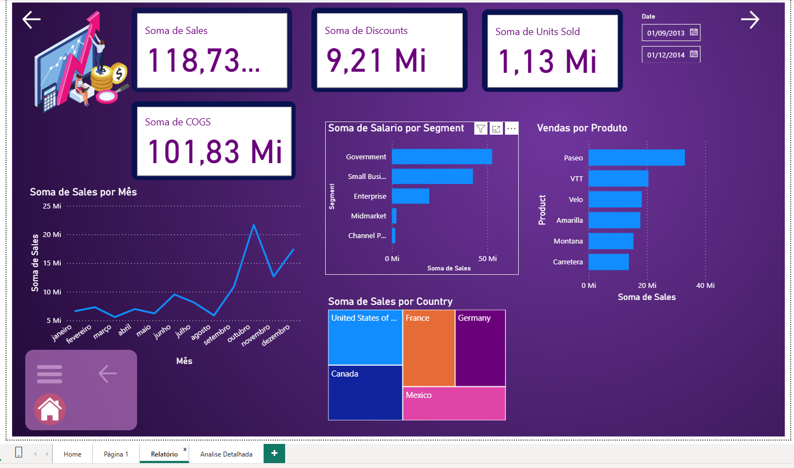
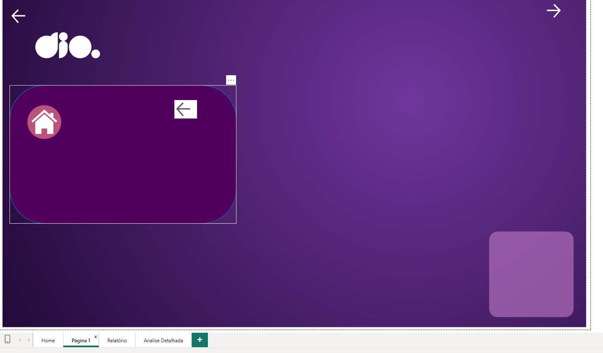
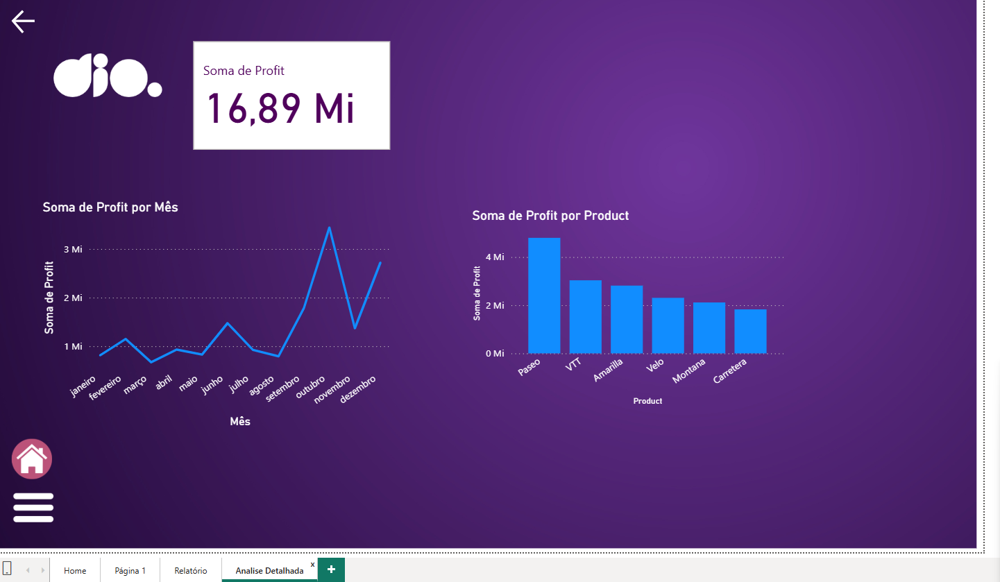

# Desafio DIO: Report Financeiro Interativo com Foco em UX no Power BI

Este repositório documenta a resolução do desafio de projeto da DIO "Atualizando Relatório Financeiro com Foco na Experiência do Usuário". O projeto transforma um relatório financeiro estático em uma experiência de análise interativa e profissional, com foco total na navegabilidade e na experiência do usuário (UX).

**[>> Clique aqui para acessar o Relatório Interativo <<](https://app.powerbi.com/groups/me/reports/0c9de950-0828-495b-ab3e-c891e449d104/ReportSection?experience=power-bi)**

---

## 📋 Índice

1. [Objetivo do Projeto](#-1-objetivo-do-projeto)
2. [Ferramentas Utilizadas](#-2-ferramentas-utilizadas)
3. [Funcionalidades Implementadas](#-3-funcionalidades-e-recursos-implementados)
4. [Arquivo Fonte (.pbix)](#-4-arquivo-fonte-pbix)
5. [Processo de Criação e Desafios](#-5-processo-de-criação-e-desafios-superados)
6. [Telas do Relatório](#-6-telas-do-relatório)
7. [Autor](#-7-autor)

---

## 🎯 1. Objetivo do Projeto

O objetivo central era refatorar um relatório financeiro básico no Power BI, aplicando conceitos avançados de UX/UI. O foco não era apenas exibir dados, mas criar uma jornada de análise intuitiva, onde o usuário tivesse total controle da navegação de forma clara e fluida.

Isso foi alcançado através da implementação de um sistema de navegação completo, menus interativos e uma estruturação de múltiplas páginas de análise.

## 🛠️ 2. Ferramentas Utilizadas

* **Power BI Desktop:** Utilizado para modelagem de dados, criação de visuais, e implementação de toda a interatividade.
* **Painel de Seleção (Selection Pane):** Para agrupar e gerenciar a visibilidade dos objetos.
* **Indicadores (Bookmarks):** Para salvar "estados" da página e criar a funcionalidade do menu.
* **Ações de Botão (Button Actions):** Para criar os gatilhos de navegação e interatividade.

## ✨ 3. Funcionalidades e Recursos Implementados

Este relatório vai além de visuais estáticos e inclui as seguintes funcionalidades:

* **Página "Home" de Apresentação:** Uma capa profissional que serve como ponto de entrada para a análise.
* **Navegação Rápida:** Botões de ação que direcionam o usuário da "Home" para as páginas de análise.
* **Menu Lateral Interativo (Menu Hambúrguer):** Um menu "hambúrguer" personalizado que se expande e recolhe, permitindo ao usuário navegar entre as diferentes páginas de análise ou retornar à "Home" sem poluir a tela.
* **Múltiplas Páginas de Análise:**
    * **Análise de Vendas:** Uma dashboard focada em métricas de faturamento (Sales), descontos e unidades vendidas.
    * **Análise Detalhada (Lucro):** Uma dashboard focada em métricas de lucratividade (Profit), analisando o lucro ao longo do tempo e por produto.
* **Feedback Visual (UX):** Botões com efeitos "Ao Focalizar" (*On Hover*) que mudam de aparência ao passar o mouse, fornecendo um feedback claro de interatividade ao usuário.

## 📂 4. Arquivo Fonte (.pbix)

O arquivo fonte `.pbix` (`desafio-dio-dashboards.pbix`) está incluído neste repositório. Você pode baixá-lo e abri-lo no Power BI Desktop para explorar a modelagem, os visuais e a configuração dos indicadores e ações em detalhes.

## 📈 5. Processo de Criação e Desafios Superados

A implementação da funcionalidade de menu interativo foi a parte mais complexa e instrutiva do projeto. O processo exigiu a combinação de três painéis do Power BI: **Seleção**, **Indicadores** e **Formato (Ações)**.

#### O Processo:

1.  **Agrupamento (Painel de Seleção):** A primeira etapa foi criar o visual do menu (o painel de fundo, o ícone "casa", o ícone de "fechar") e agrupá-los em um único objeto (`Grupo_Menu`).
2.  **Criação dos Estados (Indicadores):** Foram criados dois indicadores (bookmarks) para "salvar a foto" da página em dois estados distintos:
    * `Menu Aberto`: O `Grupo_Menu` é visível, os gráficos da página são ocultados, e o botão de "abrir" (hambúrguer) é ocultado.
    * `Menu Fechado`: O `Grupo_Menu` é ocultado, os gráficos são exibidos, e o botão de "abrir" é visível.
3.  **Ativação (Ações):** Os botões foram "ligados" aos indicadores. O botão "hambúrguer" ativa o indicador `Menu Aberto`, e o botão "fechar" (dentro do menu) ativa o indicador `Menu Fechado`.

#### Dificuldades Enfrentadas e Soluções:

Durante a implementação, surgiram diversos desafios comuns que exigiram depuração cuidadosa:

* **Desafio 1: "Os gráficos sumiram!"**
    * **Problema:** Ao criar o indicador `Menu Fechado`, os gráficos não reapareciam, deixando a tela em branco.
    * **Solução:** O indicador `Menu Fechado` foi "salvo" por engano com os gráficos ocultos. A solução foi reconfigurá-lo: selecionar o indicador, **mostrar** manualmente todos os gráficos no Painel de Seleção e, então, clicar em "Atualizar" no indicador.

* **Desafio 2: "O botão de abrir o menu desaparece junto com o menu!"**
    * **Problema:** O botão "hambúrguer" (que abre o menu) foi acidentalmente incluído *dentro* do `Grupo_Menu`. Ao fechar o menu (ocultando o grupo), o botão para abri-lo novamente também sumia.
    * **Solução:** O botão "hambúrguer" foi **retirado do grupo** no Painel de Seleção. Os indicadores `Aberto` e `Fechado` foram atualizados para gerenciar a visibilidade desse botão de forma independente (escondê-lo quando o menu está aberto, mostrá-lo quando está fechado).

* **Desafio 3: "O botão de fechar não some!"**
    * **Problema:** O oposto do Desafio 2. O botão de fechar (a "seta") foi deixado *fora* do grupo de menu, fazendo com que ficasse sempre visível na tela, mesmo com o menu fechado.
    * **Solução:** O botão "seta" foi arrastado para *dentro* do `Grupo_Menu`, garantindo que ele só aparecesse quando o grupo de menu estivesse visível.

A superação desses desafios foi fundamental para o aprendizado e para garantir uma funcionalidade robusta e livre de bugs.

## 📸 6. Telas do Relatório

| Página Home | Análise de Vendas (Menu Fechado) |
| :---: | :---: |
|  |  |

| Análise de Vendas (Menu Aberto) | Análise Detalhada (Lucro) |
| :---: | :---: |
|  |  |

---

## 👤 7. Autor

**João Vitor**

* [LinkedIn](https://www.linkedin.com/in/jo%C3%A3o-vitor-vargas-martins-b67b29292/)
* [Portfólio (se houver)](https://portfolio-wenes11-omega.vercel.app/)
